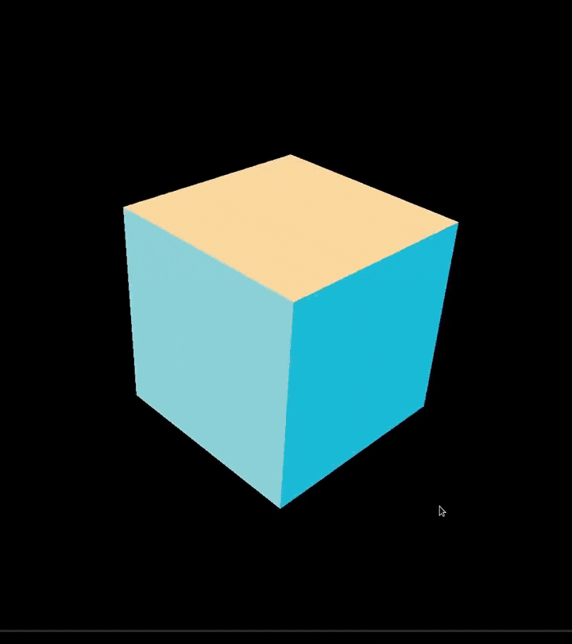

# Popcorn Engine

This is my attempt to learn Computer Graphics with Vulkan after many years of working with WebGL and ThreeJS. I hope to write a game like INSIDE (2016) by Playdead one day with Popcorn. I am mainly focusing on the behaviour of lights and how the interact with material surfaces.
I am modelling my API after ThreeJS, because I really like it's easy to use but flexible API.

## Currently working on

- Rasterized lighting integration (Deferred lighting)
- Raytracing integration

## Demo (last significant update)



## Features

- Vulkan-based rendering pipeline
- Deferred rendering with G-buffer and lighting pass
- Support for PBR and basic material types
- TinyGLTF integration for loading Blender models with vertex colors

## Installation

Enter these commands for installation on linux.

```sh
git clone https://github.com/pravasith/popcorn.git
cd popcorn/Engine/
./scripts/linux-setup.sh
```

## Build 

After the setup, if you wish to build for linux or windows (cross-compile), enter these commands for installation on linux.

```sh
git clone https://github.com/pravasith/popcorn.git
cd popcorn/Engine/
./scripts/build.sh
```

In the prompt, enter 'l' for linux build, and 'w' for a windows build.
 
## Sandbox 

To create a application/game with Popcorn engine, simply copy any example sandbox folder, rename it and modify the `main.cpp` file to get started.

The API for usage looks like this (in this example, we are making a simple rotating cube) -
You can create `Layer`s and use the useful methods like `OnEvent()`, `OnUpdate()` and `OnRender()` methods

```cpp
using namespace Popcorn;

class GameLayer : public Layer {
  class TriangleScene : public Scene {};

public:
  GameLayer() {};
  ~GameLayer() {};

  virtual void OnAttach() override {
    // Create VertexBuffer
    vertexBuffer = VertexBuffer::Create();
    // Create 
    indexBuffer = new IndexBuffer<uint16_t>();

    vertexBuffer->SetLayout<BufferDefs::AttrTypes::Float3,
                            BufferDefs::AttrTypes::Float3>();

    // Single quad data (shared by all cube faces)
    vertexBuffer->Fill<Vertex>({{{-0.5f, -0.5f, .0f}, {1.0f, 0.0f, 0.0f}},
                                {{0.5f, -0.5f, .0f}, {0.0f, 1.0f, 0.0f}},
                                {{0.5f, 0.5f, .0f}, {0.0f, 0.0f, 1.0f}},
                                {{-0.5f, 0.5f, .0f}, {1.0f, 1.0f, 1.0f}}});

    indexBuffer->Fill({0, 1, 2, 2, 3, 0});

    // Material setup
    std::vector shaderFiles{"shaders/tri_vert.spv", "shaders/tri_frag.spv"};
    MaterialData matData{(ShaderStages::VertexBit | ShaderStages::FragmentBit),
                         shaderFiles};
    triMat = new BasicMaterial(matData);

    mesh = new Mesh{*vertexBuffer, indexBuffer, *triMat};

    mesh->SetPosition({.0f, 1.f, 0.f});
    mesh->RotateX(glm::radians(-90.f));

    triScene.AddNode(mesh);

    auto &renderer = Popcorn::Context::GetRenderer();
    renderer.AddScene(&triScene);
  };

  virtual void OnDetach() override {
    delete triMat;
    triMat = nullptr;

    delete indexBuffer;
    indexBuffer = nullptr;

    VertexBuffer::Destroy(vertexBuffer);
    delete mesh;
  };

  virtual void OnUpdate(TimeEvent &e) override {
    mesh->RotateZ(glm::radians(90.f) * e.GetDeltaS());
    triScene.Update();
  };

  virtual void OnRender() override { Renderer::Get().DrawFrame(triScene); };

  virtual bool OnEvent(Event &e) override { return false; };

private:
  VertexBuffer *vertexBuffer;
  IndexBuffer<uint16_t> *indexBuffer;
  TriangleScene triScene;
  Mesh *mesh;
  Material *triMat;
};

// THE MAIN FUNCTION
int main(int argc, char **argv) {
  Popcorn::Context::Begin();

  auto gameLayer = new GameLayer();
  Application::AddLayer(gameLayer);

  Popcorn::Context::RunGame();

  Popcorn::Context::End();
  return 0;
}
```
 
## Custom shaders

You can write your own shaders in `assets/shaders/` folder and set their paths as strings while creating the material.
Don't forget to compile your shaders with these commands (make sure you are in your sandbox folder -

```sh
cd Sandbox/YourGameAppFolder/ 
./scripts/compile-shaders.sh
```

## Build your game

After the setup, if you wish to build for linux or windows (cross-compile), enter these commands for installation on linux.

```sh
cd Sandbox/YourGameAppFolder/ 
./scripts/build.sh
```

## Run you game

The executables are created in the `dist/linux/bin/` folder (for linux) and `dist/windows/bin/` folder (for windows).
